# airflow-openlineage-demo

## Overview

This project provides an example of how to capture OpenLineage events from Airflow using [watsonx.data intelligence](https://www.ibm.com/solutions/data-intelligence). 

A demo video of this project is included [here](demo-video/airflow-lineage-20260513.mp4).

The example is based on an airline flight disruption use case. There is a business critical flight disruption dashboard which gets its data from the database table <code>disruption_summary</code>. However, it's not clear how that table is populated. 

This demo shows how capturing [OpenLineage events](https://openlineage.io/) from Airflow using watsonx.data intelligence will "connect the dots" for the path data takes as it is written to the <code>disruption_summary</code> table and then displayed on the dashboard.

Here is a view of the lineage before the Airflow Dag's dependencies are captured, which shows the gap:

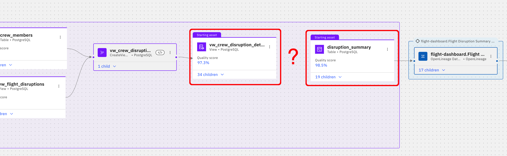


Here is a view of the final result of the demo that shows that data was read from the view <code>vw_crew_disruption_detail</code> by the Airflow Dag <code>airline_crew_disruption</code> which processed the data and then wrote to the <code>disruption_summary</code> table. 

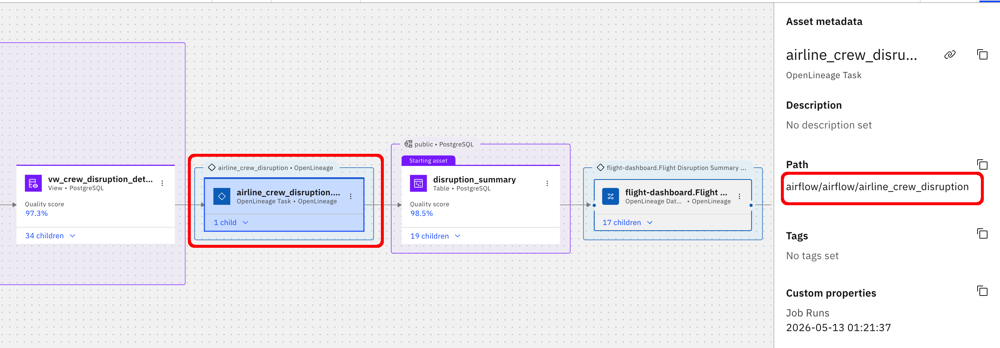


One can also view column level lineage through the Dag:

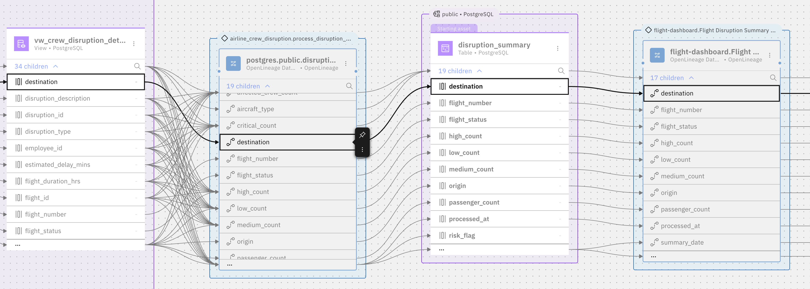


The lineage info is, of course, also available using the [watsonx.data intelligence MCP Server](https://github.com/IBM/data-intelligence-mcp-server/blob/main/README.md):

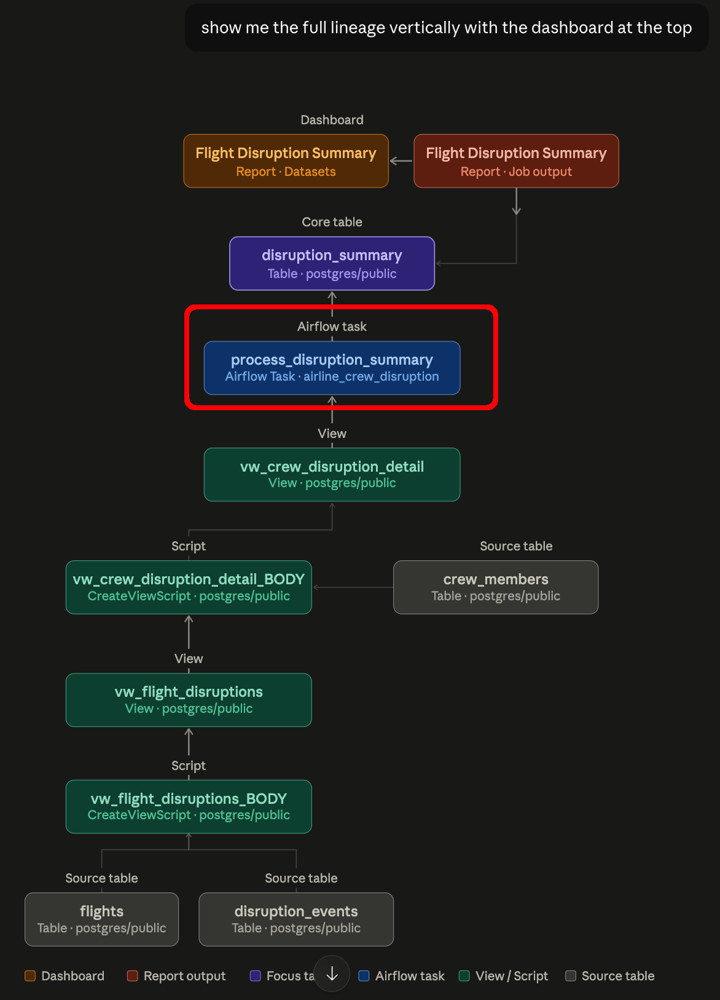


## Prerequisites

- A watsonx.data intelligence environment.  For this example I am using [this TechZone instance](https://techzone.ibm.com/search?searchbox=%22watsonx.data+intelligence+Bundle+%28DPH+Initialization+-+No+UDI%29%22&StatusFilter=Active%2CEnabled).  Note that this environment only allows three sources to be scanned for lineage, so you'll probably want to use a new instance of this environment for this demo.

- A PostgreSQL database.  If a SaaS version of watsonx.data intelligence is used, as in this example, the PostgreSQL database must be accessible using a public IP or hostname in order to be reachable by the metadata import process. If a software version of watsonx.data intelligence is used, a public IP may not be necessary. This project does not provide the steps to install a PostgreSQL database.

- An instance of [Airflow](https://airflow.apache.org/) must either be available (running on any OS or environment) or can be installed using the instructions below that describe how to install an instance of Airflow using [Astonomer](https://www.astronomer.io/)'s [Astro CLI](https://www.astronomer.io/docs/astro/cli/overview) on RHEL9. This example installs Airflow v3.1.8+astro.1.

- These plugins are needed by Airflow:

	- apache-airflow-providers-openlineage

	- apache-airflow-providers-postgres[openlineage]
	
	- A custom OpenLineage Transport provided within the project as [plugins/ibm_iam_transport.py](plugins/ibm_iam_transport.py) which simplifies calling the watsonx.data intelligence lineage endpoint with its dual-header auth scheme.
	

	
## References

- See the comprehensive end-to-end lab [here](https://ibm.ent.box.com/s/794fyuwfiwg8nrt4ova0sjxekeuekuz3) for additional details on how to accomplish some of the watsonx.data intelligence setup steps described below	.

## Create the PostgreSQL database resources
Execute the [sql/airline_disruption_setup.sql](sql/airline_disruption_setup.sql) script in the PostgreSQL database's public schema using your database tool of choice.

The following resources will be created:

- Tables
	- crew_members
	- disruption_events
	- disruption_summary
	- flights
- Views
	- vw_crew_disruption_detail
	- vw_flight_disruptions_
	


## Add a watsonx.data intelligence DSD for the PostgreSQL database

Create a new Data Source Definition (DSD) for your PostgreSQL database.

- Select Data > Connectivity > Data source definitions > New data source definition


- If you are using watsonx.data intelligence SaaS, enter an endpoint in the DSD for the public IP or hostname needed to connect to the database, and optionally, if PostgreSQL can be reached over a private IP or hostname (for example, if Airflow connects to PostgreSQL over a private subnet), enter another endpoint for PostgreSQL's private IP or hostname.  Here are the endpoints in my environment, with both public and private IP addresses:

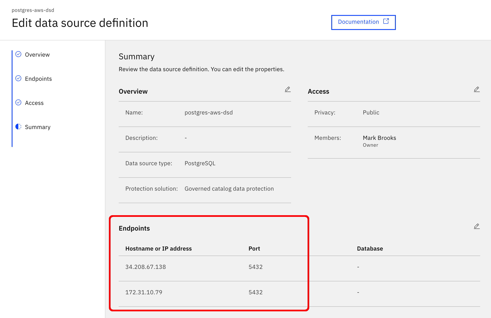


## Add a watsonx.data intelligence Platform Connection for your PostgreSQL database

Create a new Platform Connection for your PostgreSQL database.

- With the project, create a new asset "Connect to a Data"

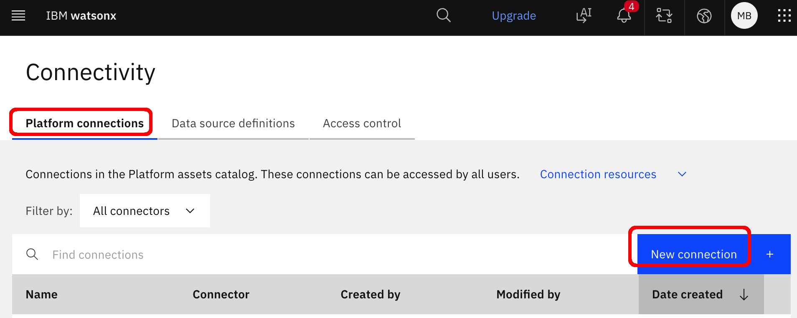

If you are using watsonx.data intelligence SaaS, enter a public IP or hostname for your PostgreSQL database:

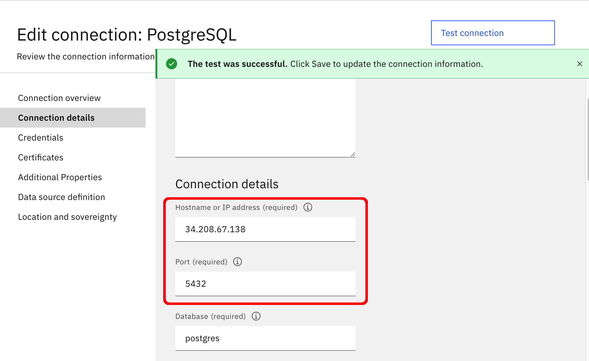
 
 
## Create a watsonx.data intelligence project

Create a watsonx.data intelligence project named <code>airflow-postgres-lineage</code> (the name is not critical).

## Create a project level connection using the Platform Connection

- Choose New Asset and pick "Connect to a data source": 


- Select the postgres Platform Connection created earlier: 


- Click Next and then click Create.


## Run a metadata import for the PostgreSQL database resources

Within the project, create and run a metadata import for the PostgreSQL database resources.  Use these settings:

- Select both Import asset metadata and Import lineage metadata:


- Select your PostgreSQL DSD and Connection:

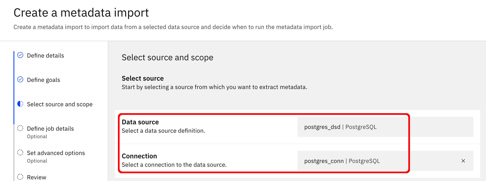

- Click the edit button for the Scope of the Asset Metadata and select the four tables and two views:

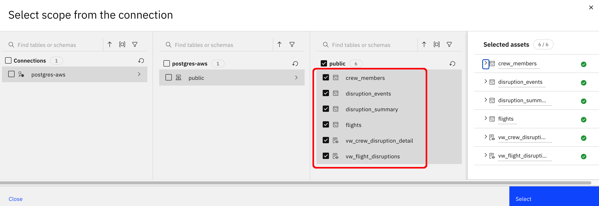

- Click the edit button for the Scope of the Lineage Metadata and select the <code>public</code> schema:

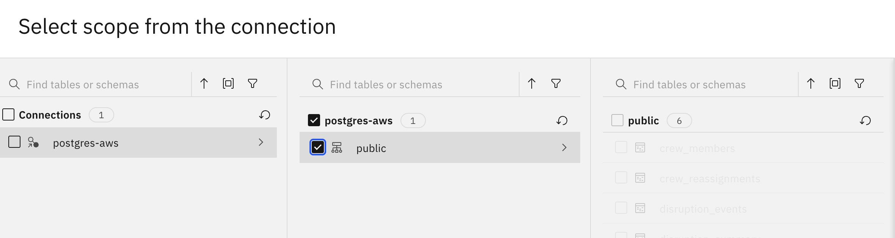
	
- Run the Metadata Import Job

## Run a metadata enrichment for the PostgreSQL database resources 

Within the project, create and run a metadata enrichment for the PostgreSQL database resources.  Use these settings:

- Select the metadata import from the the previous step:


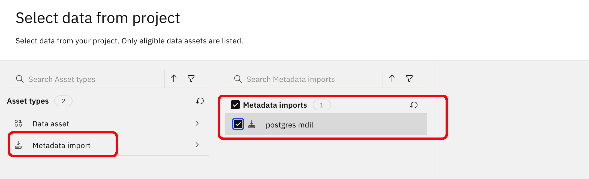

- Select all the enrichment objectives:


- Select the <code>uncategorized</code> category and basic sampling:


- Run the Metadata Enrichment Job


## Import lineage for the mock dashboard
This project contains openlineage event files for a mock dashboard that reads the <code>disruption_summary</code> table.  Here are the steps to import those events:

- Copy the two files [here](openlineage-events/) to your local machine.


- Generate an IBM Cloud API key for your account and set it as an environment variable in a terminal session:

```
IBM_CLOUD_API_KEY="<your IBM Cloud Key>"
```

- Generate a bearer token:

```
TOKEN=$(curl -s -X POST \
  'https://iam.cloud.ibm.com/identity/token' \
  -H 'Content-Type: application/x-www-form-urlencoded' \
  -d "grant_type=urn:ibm:params:oauth:grant-type:apikey&apikey=${IBM_CLOUD_API_KEY}" \
  | python3 -c "import sys,json; print(json.load(sys.stdin)['access_token'])")
```
- Post the <code>dashboard-start-event.json</code> file to the openlineage endpoint (edit the path  to the file for your  environment):
```
curl -v \
  "https://api.ca-tor.dai.cloud.ibm.com/gov_lineage/v2/lineage_events/openlineage" \
  -X POST \
  -H "Authorization: Bearer $TOKEN" \
  -H "Content-Type: application/json" \
  -d @/path/to/dashboard-start-event.json
```
- You should receive an HTTP 201 response  code

- Post the <code>dashboard-complete-event.json</code> file to the openlineage endpoint (edit the path  to the file for your  environment):
```
curl -v \
  "https://api.ca-tor.dai.cloud.ibm.com/gov_lineage/v2/lineage_events/openlineage" \
  -X POST \
  -H "Authorization: Bearer $TOKEN" \
  -H "Content-Type: application/json" \
  -d @/path/to/dashboard-complete-event.json
```
- You should receive an HTTP 201 response  code

- Confirm the lineage events are successfully processed by .data intelligence:

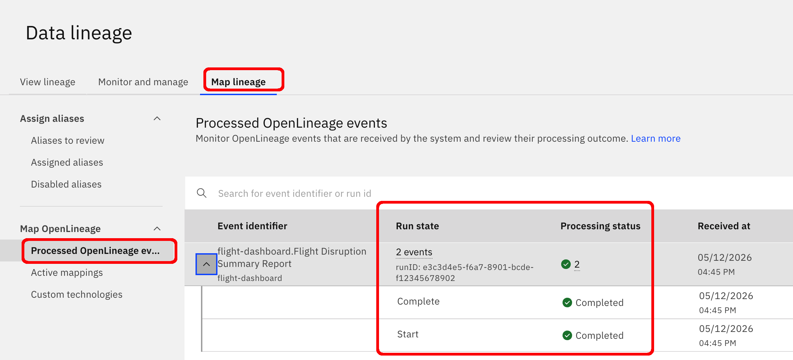


## Inspect the lineage and see the gap


- After the Metadata import Job completes, create a Lineage graph including the <code>vw_crew_disruption_detail</code> view and the <code>disruption_summary</code> table.  We can see full lineage for where the view <code>vw_crew_disruption_detail</code> gets its data, and we can see that the dashboard report gets data from the <code>disuruption_summary</code> table but we do not see where the <code>disuruption_summary</code> table gets its data from:


To close that gap, we'll configure Airflow to send OpenLineage events to watsonx.data integration when the Dag that populates the <code>disruption_summary</code> table executes.

## Which Airflow instance to use?
You could use any instance of Airflow v3.x you have access to though you will need to configure it to push OpenLineage events to watsonx.data intelligence using the custom OpenLineage transport mentioned above. That transport has only been tested with Airflow 3.1.x; it might not work with Airflow v2.x.

For this example, I've provided instructions for installing Airflow v3.1 using [Astonomer](https://www.astronomer.io/)'s [Astro CLI](https://www.astronomer.io/docs/astro/cli/overview) on RHEL9.


## Install Airflow on RHEL9 using the Astro CLI

### Step 1 — Install Docker

```
sudo dnf config-manager --add-repo https://download.docker.com/linux/rhel/docker-ce.repo
sudo dnf install -y docker-ce docker-ce-cli containerd.io docker-compose-plugin
sudo systemctl start docker
sudo systemctl enable docker
sudo usermod -aG docker $USER
newgrp docker
docker --version
```

### Step 2 — Install Astro CLI
```
curl -sSL install.astronomer.io | sudo bash
```
astro version

### Step 3 — Create and initialize the Airflow environment

```
mkdir -p  ~/airflow/config
cd ~/airflow
astro dev init
```
### Step 4 — Create a custom OpenLineage transport
A custom OpenLineage transport simplifies the process of Airflow generating bearer tokens for the OpenLineage REST API calls to the watsonx.data intelligence lineage endpoint.  The custom transport also does a little cleanup on the OpenLineage payload by removing <code>"dataset": []</code> elements not currently supported by .data intelligence.

Copy the file [plugins/ibm_iam_transport.py](plugins/ibm_iam_transport.py) to the directory <code>~/airflow/plugins</code>

### Step 5 — Create openlineage.yml 
```
cat > config/openlineage.yml << 'EOF'
transport:
  type: "ibm_iam_transport.IbmWatsonxTransport"
EOF
```

### Step 6 — Create requirements.txt
```
cat > requirements.txt << 'EOF'
apache-airflow-providers-openlineage
apache-airflow-providers-postgres[openlineage]
EOF
```

### Step 7 — Update Dockerfile
```
cat > Dockerfile << 'EOF'
FROM quay.io/astronomer/astro-runtime:3.1
COPY requirements.txt .
RUN pip install -r requirements.txt
EOF
```

### Step 8 - Create .env

Create the file <code>~/airflow/.env</code> with the following text, including your own <code>IBM_API_KEY</code> on line 2 and your own <code>IBM_OPENLINEAGE_URL</code> on line 3 if you are running watsonx.data inteligence in a region other than ca-tor, or if it is running as software rather than SaaS.

```
# IBM watsonx.data credentials
IBM_API_KEY=YOUR_IBM_API_KEY_HERE
IBM_OPENLINEAGE_URL=https://api.ca-tor.dai.cloud.ibm.com/gov_lineage/v2/lineage_events/openlineage

# OpenLineage configuration
AIRFLOW__OPENLINEAGE__CONFIG_PATH=/usr/local/airflow/config/openlineage.yml
AIRFLOW__OPENLINEAGE__NAMESPACE=my-airflow-rhel9

# Airflow core settings
AIRFLOW__CORE__MP_START_METHOD=spawn
AIRFLOW__CORE__LOAD_EXAMPLES=False

# Airflow web settings
AIRFLOW__WEBSERVER__BASE_URL=http://localhost:8080
AIRFLOW__API__BASE_URL=http://localhost:8080

# Python path for plugins
PYTHONPATH=/usr/local/airflow/plugins
```

### Step 9 - Start Airflow
```
astro dev start
```

You should see output like this:
```
$ astro dev start
✔ Project image has been updated
✔ Project started
➤ Airflow UI: http://airflow.localhost:6563
➤ Postgres Database: postgresql://localhost:5432/postgres
➤ The default Postgres DB credentials are: postgres:postgres
Unable to open the Airflow UI, please visit the following link: http://airflow.localhost:6563
```

Don't worry about that <code>"Unable to open..."</code> message; we'll deal with that next.

### Step 10 - Connect to the Airflow UI with your browser
If you can open port 8080 on the Airflow VM to accept calls from your local machine, follow these steps to connect to the Airflow UI in your browser from your local machine:

- Get the public IP or hostname of your Airflow VM. For example, mine is <code>16.148.128.6</code>

- Edit <code>~/airflow/.env</code> and change the environment variables to point to your public IP or hostname.  For example, in my environment I'll replace these two lines:

```
	AIRFLOW__WEBSERVER__BASE_URL=http://localhost:8080
	AIRFLOW__API__BASE_URL=http://localhost:8080
```

with these three lines::

```
	AIRFLOW__WEBSERVER__BASE_URL=http://16.148.128.6:8080
	AIRFLOW__API__BASE_URL=http://16.148.128.6:8080
	AIRFLOW__API_SERVER__BASE_URL=http://16.148.128.6:8080
	
```

Next, edit the file <code>~/.astro/config.yaml</code> and in the <code>airflow</code> section,  change this setting:

```
     expose_port: "false"
```

to this:
```
    expose_port: "true"
```

And then restart Airflow:

```
astro dev restart
```

Point your browser to <code>http://\<airflow public IP or hostname\>:8080</code> and you should see the UI:

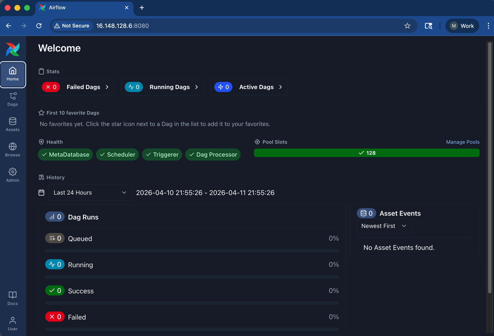

If you can't open port 8080 to external traffic, or if you prefer a more secure option, you could open an ssh tunnel from your client machine using a command like this:

```
	ssh -L 8080:localhost:8080 ec2-user@16.148.128.6 (keep the terminal open)
```
or run the tunnel as a background process like this:

```
	ssh -f -N -L 8080:localhost:8080 ec2-user@16.148.128.6
```
 and then kill that process when you are done with a command like this:
 
 ```
 	kill $(lsof -t -i:8080)
 ```
 
 Once you have an ssh tunnel, connect to the Airflow UI from your local machine using the URL <code>http://localhost:8080</code>
 
 

 
## Add a PostgreSQL Database Connection to Airflow

In the Airflow UI, choose Admin > Connections > Add Connection and create a PostgreSQL connection to your own database. Set the Connection type to <code>Postgres</code>, set the Connection ID to <code>postgres</code>, and fill in the other properties to connect to your database.  For example, my settings look like this because Airflow is using a private IP to reach the PostgreSQL database:

 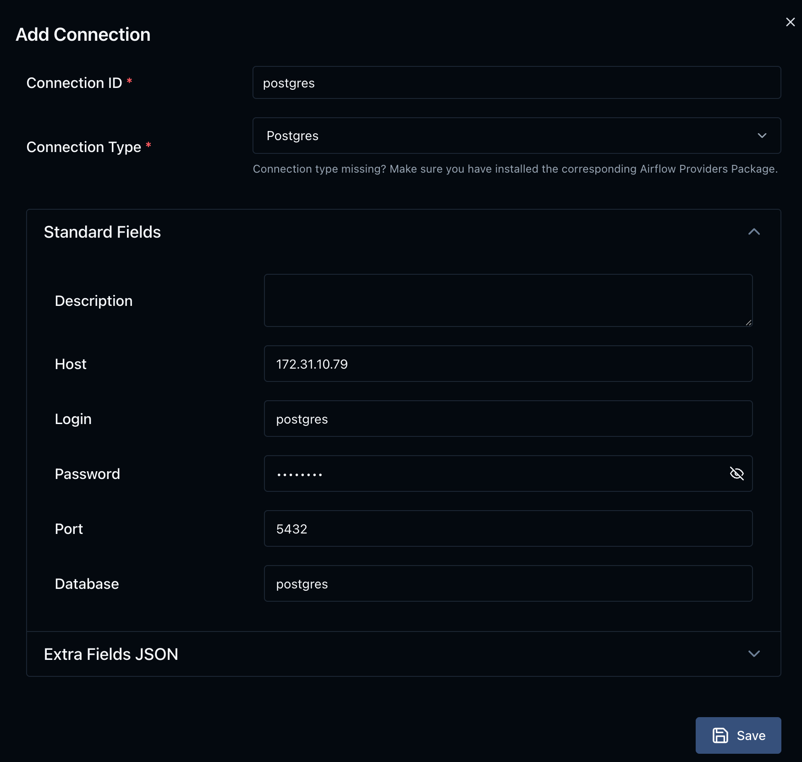

 
##  Import the example Dag

Copy the file [dags/airline_disruption_dag.py](dags/airline_disruption_dag.py) to your Airflow VM's $AIRFLOW_HOME/dags directory. 

List the DagS to make sure Postgres has picked it up using this command:

```
docker exec $(docker ps --format "{{.Names}}" | grep scheduler) airflow dags list
```

You should see output like this:


	$ docker exec $(docker ps --format "{{.Names}}" | grep scheduler) airflow dags list
	...
	dag_id                  | fileloc                                       | owners  | is_paused | bundle_name | bundle_version
	========================+===============================================+=========+===========+=============+===============
	airline_crew_disruption | /usr/local/airflow/dags/disruption_summary.py | airflow | True      | dags-folder | None


If your new Dag doesn't show up in a minute, restart Airflow:
```
astro dev restart
```

and list the Dags again.

##  Execute the Dag

In the Airflow UI, unpause the Dag by clicking the Pause toggle and then the Trigger Dag button:

 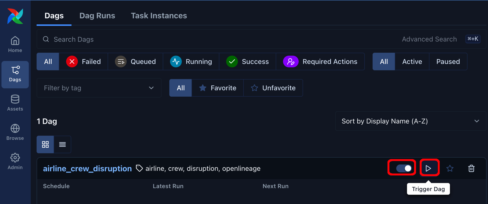

Accept the Single Run default setting and click the Trigger button:

 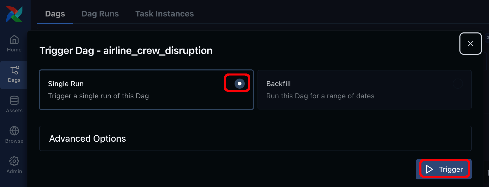

Drill down on the Dag and make sure it completed successfully:

 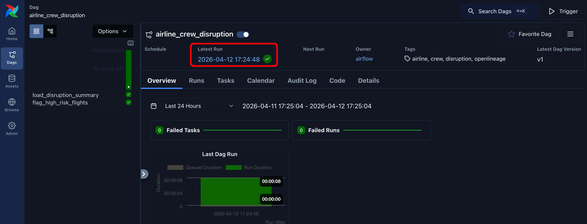

Confirm the PostgreSQL table <code>disruption_summary</code> now has data in it:

 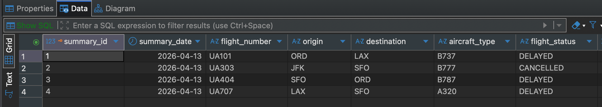


## Confirm that OpenLineage events were sent from Airflow

Tail the log of the Airflow Scheduler using a command like this:

```
docker logs $(docker ps --format "{{.Names}}" | grep scheduler) -f | grep -i -E "Successfully|openlineage|ibm|401"
```
You should see confirmation that the START and COMPLETE events were emitted without any errors:

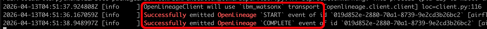

## Confirm that OpenLineage events were received by watsonx.data intelligence 

Navigate to Data > Data lineage > Map lineage > Processed OpenLineage events to see the START and COMPLETE events received by watsonx.data intelligence:
 
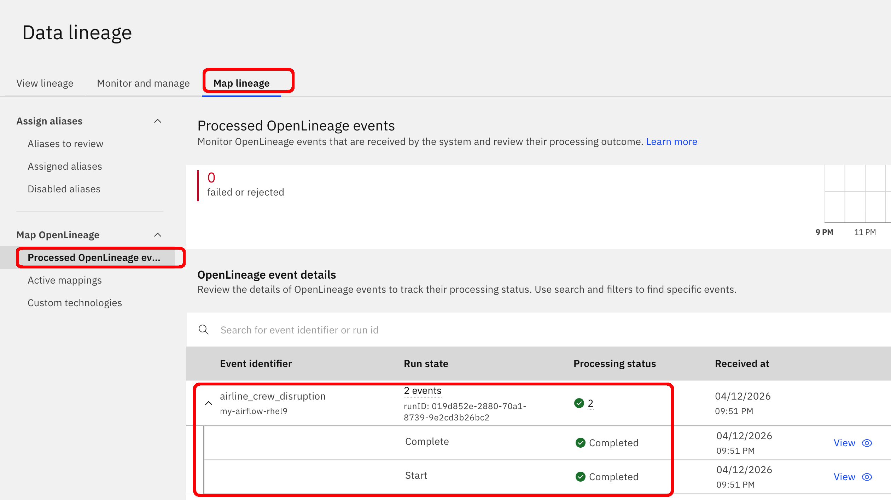


## View the completed lineage

The lineage now shows the path of the data that lands in the <code>disruption_summary</code> table: the data was read from the view <code>vw_crew_disruption_detail</code> by the Airflow Dag <code>airline_crew_disruption</code> which processed the data and then wrote to the <code>disruption_summary</code> table.

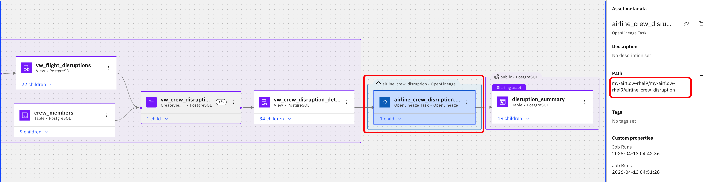


## Example Airflow OpenLineage Events
There are a couple of example Airflow OpenLineage event payloads in the folder [here](openlineage-events).  

## Final note
Hopefully this example helps describe the setup needed to integrate Airflow with watsonx.data intelligence. Feel free to ping me (mark.brooks@ibm.com) over email or Slack if you have any questions about this project.
