# airflow-openlineage-demo

## Overview

This project provides an example of how to capture OpenLineage events from Airflow using [watsonx.data intelligence](https://www.ibm.com/solutions/data-intelligence). 

A demo video of this project is included [here](demo-video/airflow-lineage-20260513.mp4).

The example is based on an airline flight disruption use case. There is a business critical flight disruption dashboard which gets its data from the database table <code>disruption_summary</code>. However, it's not clear how that table is populated. 

This demo shows how capturing [OpenLineage events](https://openlineage.io/) from Airflow using watsonx.data intelligence will "connect the dots" for the path data takes as it is written to the <code>disruption_summary</code> table and then displayed on the dashboard.

Here is a view of the lineage before the Airflow Dag's dependencies are captured, which shows the gap:


Here is a view of the final result of the demo that shows that data was read from the view <code>vw_crew_disruption_detail</code> by the Airflow Dag <code>airline_crew_disruption</code> which processed the data and then wrote to the <code>disruption_summary</code> table. 


One can also view column level lineage through the Dag:


The lineage info is, of course, also available using the [watsonx.data intelligence MCP Server](https://github.com/IBM/data-intelligence-mcp-server/blob/main/README.md):


## Prerequisites

- A watsonx.data intelligence environment.  For this example I am using [this TechZone instance](https://techzone.ibm.com/search?searchbox=%22watsonx.data+intelligence+Bundle+%28DPH+Initialization+-+No+UDI%29%22&StatusFilter=Active%2CEnabled).  Note that the watsonx. data intelligence instance only allows three sources to be scanned for lineage, so you'll probably want to use a new instance of this environment for this demo.

- A PostgreSQL database.  If a SaaS version of watsonx.data intelligence is used, as in this example, the PostgreSQL database must be accessible using a public IP or hostname in order to be reachable by the metadata import process. If a software version of watsonx.data intelligence is used, a public IP may not be necessary. 

This project uses an instance of Postgres hosted by [aiven](https://aiven.io/free-postgresql-database), using their free plan. Other providers of online free PostgreSQL are [Neon](https://neon.com/docs/postgres/overview) and [Supabase](https://supabase.com).

Here is a screenshot of my aiven-based PostgreSQL connection properties:

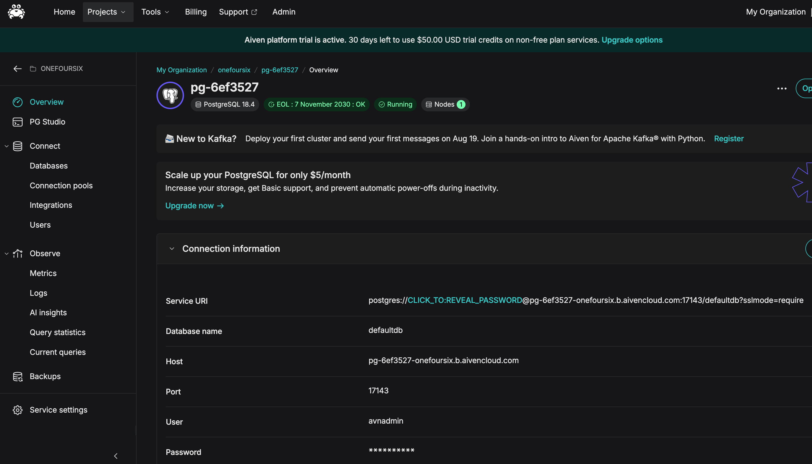

- An instance of [Airflow](https://airflow.apache.org/) must either be available (running on any OS or environment) or can be installed using the instructions below that describe how to install an instance of Airflow using [Astonomer](https://www.astronomer.io/)'s [Astro CLI](https://www.astronomer.io/docs/astro/cli/overview) on macOS running on [Podman](https://podman.io/). This example uses Airflow v3.3.0+astro.2 with Podman v6.1.0.
	
	
- If you are installing  Airflow on macOS, you'll need to install [Homebrew](https://brew.sh/) first.
	
- [Optional] A local Python3 environment in order to use the included script that updates the run id and timestamps in the mock-dashboard events. If you don't have a local Python3 environment, instructions are provided to manually edit those files.
	
## References

- See the comprehensive end-to-end lab [here](https://ibm.ent.box.com/s/794fyuwfiwg8nrt4ova0sjxekeuekuz3) for additional details on how to accomplish some of the watsonx.data intelligence setup steps described below.

## Create the PostgreSQL database resources
Execute the [sql/airline_disruption_setup.sql](sql/airline_disruption_setup.sql) script in the PostgreSQL database's public schema using your database tool of choice (I used [DBeaver](https://dbeaver.io/))

The following resources will be created:

- Tables
	- crew_members
	- disruption_events
	- disruption_summary
	- flights
- Views
	- vw_crew_disruption_detail
	- vw_flight_disruptions
	


## Add a watsonx.data intelligence DSD for the PostgreSQL database

Create a new Data Source Definition (DSD) for your PostgreSQL database.

- Select Data > Connectivity > Data source definitions > New data source definition:

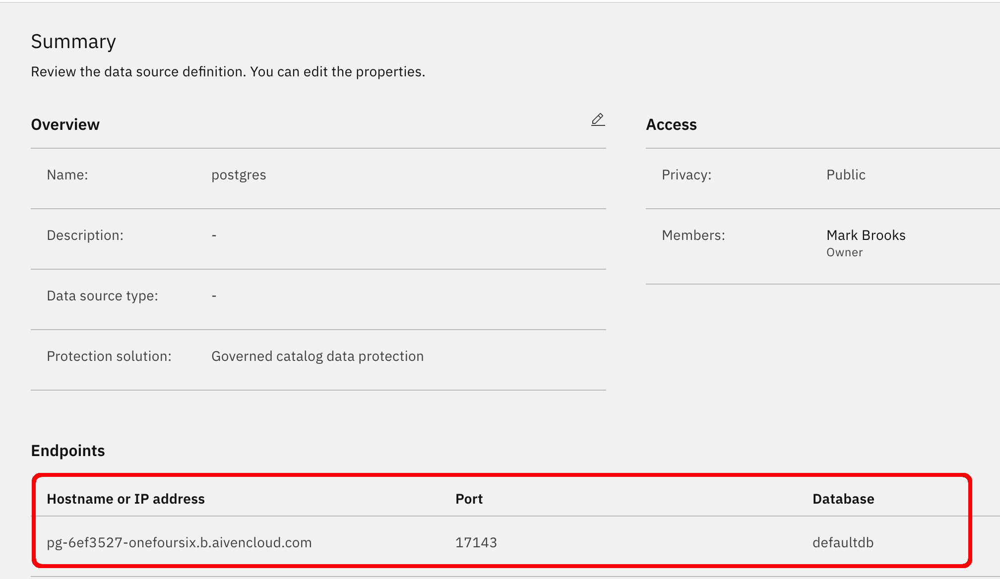


## Add a watsonx.data intelligence Platform Connection for your PostgreSQL database

Create a new Platform Connection for your PostgreSQL database:

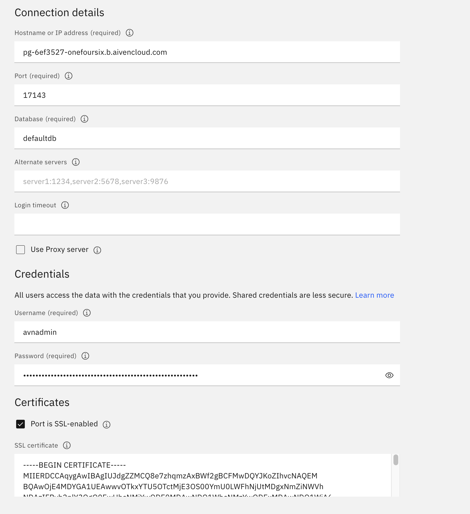


 
## Create a watsonx.data intelligence project

Create a watsonx.data intelligence project named <code>airflow-lineage</code> (the name is not critical).

## Create a project level connection using the Platform Connection

- Within the project, choose New Asset and pick "Connect to a data source": 

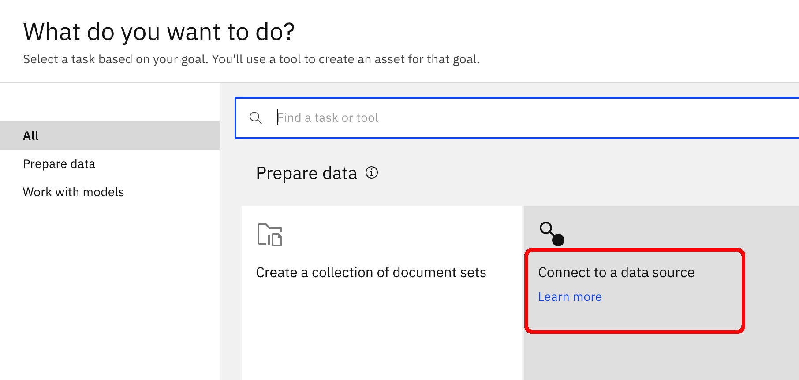

- Select the postgres Platform Connection created earlier: 

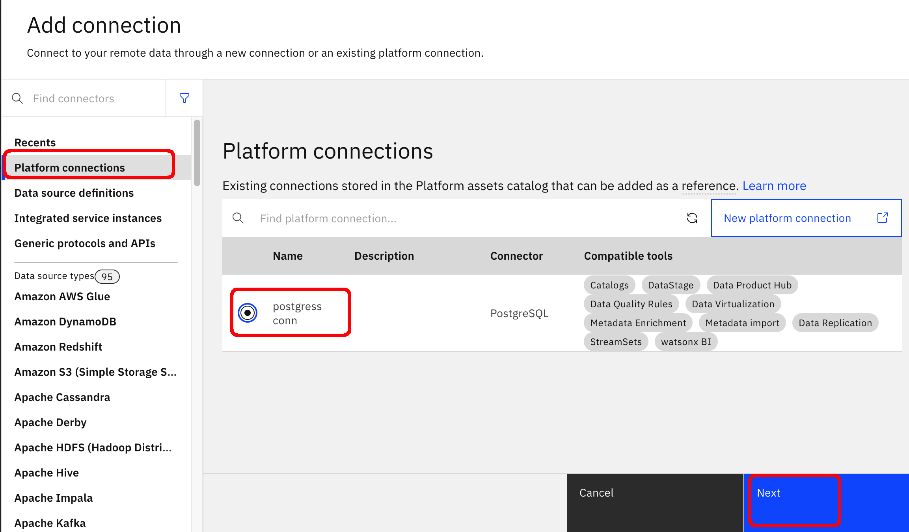


- Click Next and then click Create.


## Create a Data Quality SLA 

Create a Data Quality SLA on these tables: <code>crew_members, disruption_events, flights</code> with overall data quality of at least 99%:

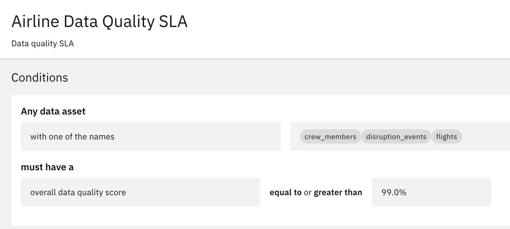


## Run a metadata import for the PostgreSQL database resources

Within the project, create and run a metadata import for the PostgreSQL database resources.  Use these settings:

- Select both Import asset metadata and Import lineage metadata:

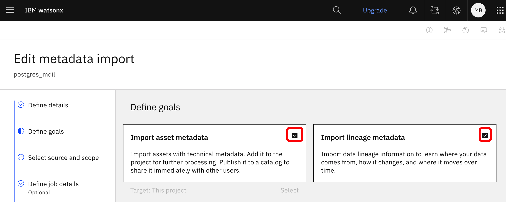

- Select your PostgreSQL DSD and Connection:


- Click the edit button for the Scope of the Asset Metadata and select the four tables and two views:


- Click the edit button for the Scope of the Lineage Metadata and select the <code>public</code> schema:


	
- Run the Metadata Import Job

## Run a metadata enrichment for the PostgreSQL database resources 

Within the project, create and run a metadata enrichment for the PostgreSQL database resources.  Use these settings:

- Select the metadata import from the the previous step:


- Select all the enrichment objectives:


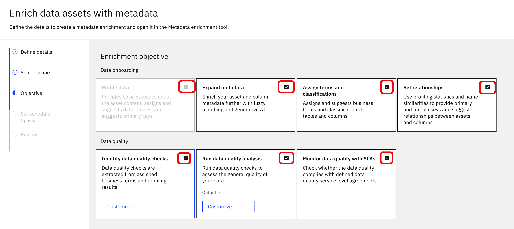


- Select the <code>uncategorized</code> category and basic sampling:

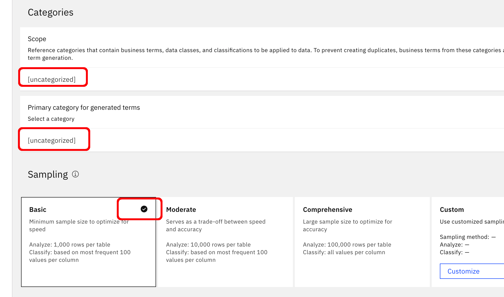

- Run the Metadata Enrichment Job


## Import lineage for the mock dashboard
This project contains openlineage event files for a mock dashboard that reads the <code>disruption_summary</code> table.

Before you can import these events into .data intelligence, you must make sure they have:

- A unique run id 
- Up-to-date timestamps.
- Database host and port values that match an endpoint in your DSD created earlier 

Here are the steps to edit the event files:

- Clone this project to your local machine.

- Switch to the project's <code>./openlineage-events/mock-dashboard</code> directory in a terminal session.

- If you have a local Python3 environment, make the script <code>refresh-mock-dashboard-events.sh</code> executable:

	<code>$ chmod +x refresh-mock-dashboard-events.sh</code>

- Execute the script:

	<code>$ ./refresh-mock-dashboard-events.sh</code>

- You should see output like this:

```
	mark@MacBookPro mock-dashboard % ./refresh-mock-dashboard-events.sh
	runId:    30b12403-b27f-4c00-8cbf-0ab582a6ea36
	start:    2026-07-29T03:17:05.000000+00:00
	complete: 2026-07-29T03:17:08.421000+00:00
	Refreshed: ./dashboard-start-event.json
	Refreshed: ./dashboard-complete-event.json
```

- If you do not have a local Python3 environment:

 	- Edit the <code>dashboard-start-event.json</code> file, search for all occurrences of 
 <code>2026-07-29T03:17:05</code> and replace all of them with a current timestamp
 
 	- Edit the <code>dashboard-complete-event.json</code> file,
search for all occurrences of <code>2026-07-29T03:17:08</code> and replace all of them with a current timestamp that is 3 seconds later than the timestamps in the 
<code>dashboard-start-event.json</code> file.  

	- Note that the "eventTime" attribute is a long format like <code>2026-07-29T03:17:05.000000+00:00</code> 
and the "nominalStartTime" and "nominalEndTime" attributes are shorter formats, like <code>"2026-07-29T03:17:05+00:00"</code>.

- Finally, find and edit all occurrences of <code>"postgres://172.31.10.79:5432"</code> in both openlineage event files to refer to the hostname or IP and port number of your postgres instance. For example, my URL is <code>"postgres://pg-6ef3527-onefoursix.b.aivencloud.com:17143"</code>

Once you have completed those edits to the mock-dashboard openlineage events, you can push them to .data intelligences' openlineage endpoint:


- Generate an IBM Cloud API key for your account and set it as an environment variable in a terminal session:

```
IBM_CLOUD_API_KEY="<your IBM Cloud Key>"
```


- Generate a bearer token:

```
TOKEN=$(curl -s -X POST \
  'https://iam.cloud.ibm.com/identity/token' \
  -H 'Content-Type: application/x-www-form-urlencoded' \
  -d "grant_type=urn:ibm:params:oauth:grant-type:apikey&apikey=${IBM_CLOUD_API_KEY}" \
  | python3 -c "import sys,json; print(json.load(sys.stdin)['access_token'])")
```
- Post the <code>dashboard-start-event.json</code> file to the openlineage endpoint (edit the path  to the file for your  environment):
```
curl -v \
  "https://api.ca-tor.dai.cloud.ibm.com/gov_lineage/v2/lineage_events/openlineage" \
  -X POST \
  -H "Authorization: Bearer $TOKEN" \
  -H "Content-Type: application/json" \
  -d @/path/to/dashboard-start-event.json
```
- You should receive an HTTP 201 response  code

- Post the <code>dashboard-complete-event.json</code> file to the openlineage endpoint (edit the path  to the file for your  environment):
```
curl -v \
  "https://api.ca-tor.dai.cloud.ibm.com/gov_lineage/v2/lineage_events/openlineage" \
  -X POST \
  -H "Authorization: Bearer $TOKEN" \
  -H "Content-Type: application/json" \
  -d @/path/to/dashboard-complete-event.json
```
- You should receive an HTTP 201 response  code

- Confirm the lineage events are successfully processed by .data intelligence:


## Inspect the lineage and see the gap


- After the Metadata import Job completes, create a Lineage graph including the <code>vw_crew_disruption_detail</code> view and the <code>disruption_summary</code> table.  We can see full lineage for where the view <code>vw_crew_disruption_detail</code> gets its data, and we can see that the dashboard report gets data from the <code>disuruption_summary</code> table but we do not see where the <code>disuruption_summary</code> table gets its data from:


To close that gap, we'll configure Airflow to send OpenLineage events to watsonx.data integration when the Dag that populates the <code>disruption_summary</code> table executes.

## Install Airflow using the Astro CLI

For this example, I'll install Airflow using [Astonomer](https://www.astronomer.io/)'s [Astro CLI](https://www.astronomer.io/docs/astro/cli/overview).

### Step 1 — Install Podman

See the docs [here](https://podman.io/docs/installation) for instructions on installing Podman. If you are using Windows, you'll need to have WSLv2 installed. Make sure to give your podman machine at least 4 vCPUs and 4 GB of memory.

### Step 2 — Install Astro CLI

Run this command in a terminal session to install the astro cli:
```
brew install astro
```

### Step 3 — Configure astro to use podman

Run this command in a terminal session to configure astro to use podman:
```
astro config set container.binary podman -g
```

### Step 4 — Create and initialize the Airflow environment
Run these commands in a terminal session to create a home directory for astro and to init the astro environment:

```
mkdir ~/airflow
cd ~/airflow
astro dev init
```

### Step 5 — Create requirements.txt
In a text editor, create the file <code>~/airflow/requirements.txt</code> with this content:
```
apache-airflow-providers-postgres[openlineage]
```

### Step 6 - Create .env

Create the file <code>~/airflow/.env</code> with the following text, including your own <code>IBM_API_KEY</code> on line 2.  Edit the value on line 4 if you are running watsonx.data inteligence in a region other than ca-tor.

```
AIRFLOW__OPENLINEAGE__NAMESPACE=airflow
OPENLINEAGE__TRANSPORT__AUTH__APIKEY=<YOUR IBM CLOUD API KEY>
OPENLINEAGE__TRANSPORT__TYPE=http
OPENLINEAGE__TRANSPORT__URL=https://api.ca-tor.dai.cloud.ibm.com
OPENLINEAGE__TRANSPORT__ENDPOINT=gov_lineage/v2/lineage_events/openlineage
OPENLINEAGE__TRANSPORT__AUTH__TYPE=jwt
OPENLINEAGE__TRANSPORT__AUTH__TOKEN_ENDPOINT=https://iam.cloud.ibm.com/identity/token
OPENLINEAGE__TRANSPORT__AUTH__GRANT_TYPE=urn:ibm:params:oauth:grant-type:apikey
OPENLINEAGE__TRANSPORT__AUTH__RESPONSE_TYPE=cloud_iam
```


### Step 7 -  Import the example Dag

Copy the file [dags/airline_disruption_dag.py](dags/airline_disruption_dag.py) to the <code>~/airflow/dags</code> directory. 

### Step 8 - Start Airflow
```
astro dev start
```

You should see output like this:
```
$ astro dev start
✔ Project image has been updated
✔ Project started
➤ Airflow UI: http://airflow.localhost:6563
➤ Postgres Database: postgresql://localhost:5432/postgres
➤ The default Postgres DB credentials are: postgres:postgres
```


## Connect to the Airflow UI with your browser

Point your browser to the Airflow UI URL printed in the previous step and you should see the UI:

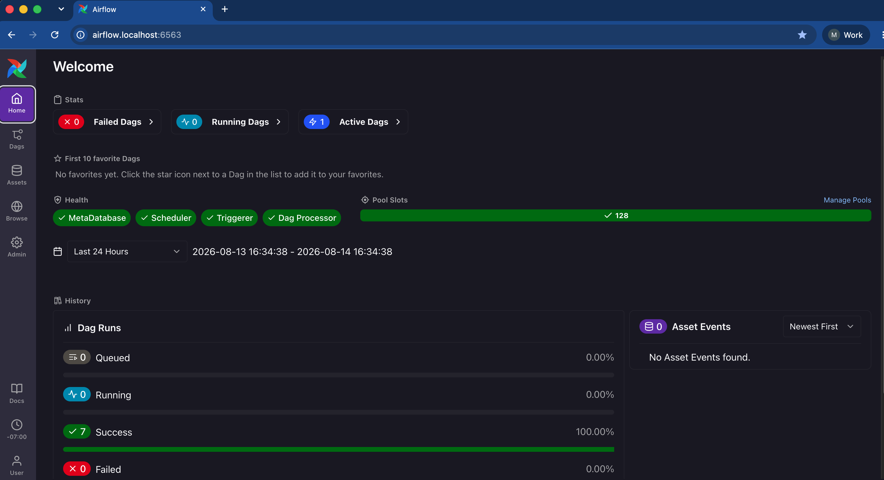


 

 
## Add a PostgreSQL Database Connection to Airflow

In the Airflow UI, choose Admin > Connections > Add Connection and create a PostgreSQL connection to your own database. Set the Connection type to <code>Postgres</code>, set the Connection ID to <code>postgres</code>, and fill in the other properties to connect to your database.  For example, my settings look like this :

 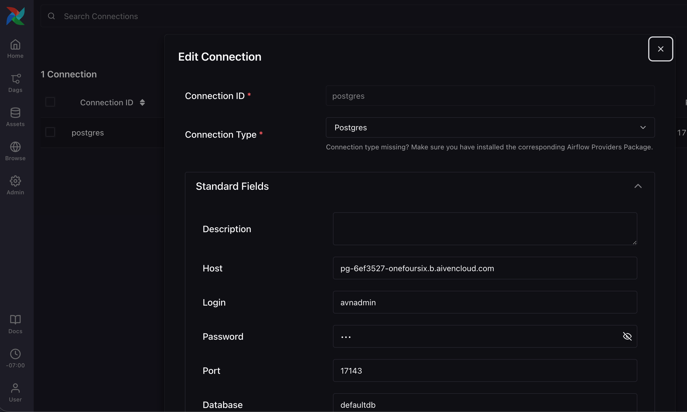

 
##  Execute the Dag

Click the Dags button in the Airflow UI, and confirm the <code>airline_crew_disruption</code> Dag appears:

 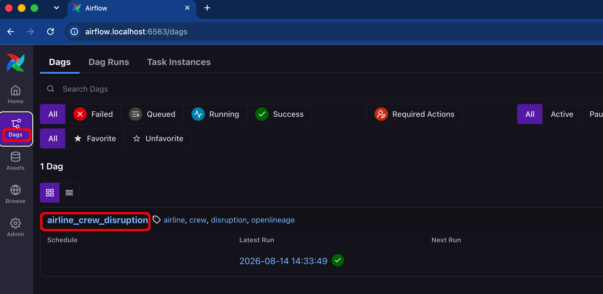

Click into the Dag, click its Trigger button and then confirm the trigger action:

 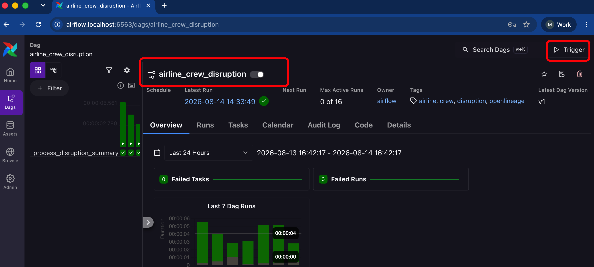

Confirm the Dag completed successfully:

 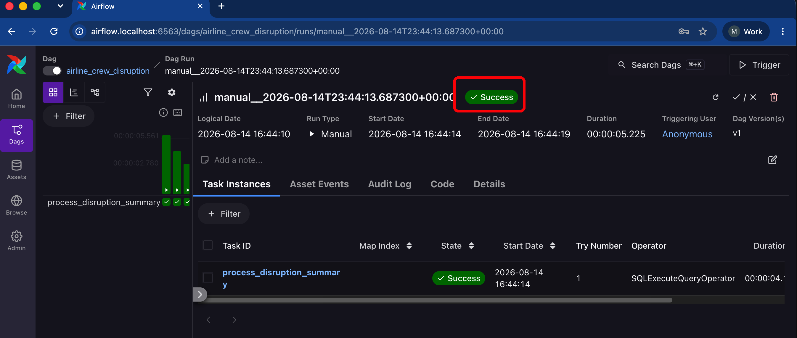

Confirm the PostgreSQL table <code>disruption_summary</code> now has data in it:

 


## Confirm that OpenLineage events were sent from Airflow

Run a command like this to confirm that Airflow successfully emitted its openlineage events:

```
podman logs -f "$(podman ps --filter name=scheduler --format '{{.Names}}')" 2>&1 | \
  grep --line-buffered -iE "Successfully emitted OpenLineage|401" | \
  sed -u -E 's/^([0-9TZ :.+-]+) \[([a-z]+) *\] (.*) \[[A-Za-z0-9_.]+\].*/\1  \2  \3/'
```
You should see confirmation that the START and COMPLETE events were emitted without any errors:

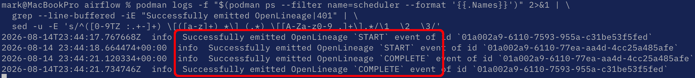

## Confirm that OpenLineage events were received by watsonx.data intelligence 

Navigate to Data > Data lineage > Map lineage > Processed OpenLineage events to see the START and COMPLETE events received by watsonx.data intelligence:
 
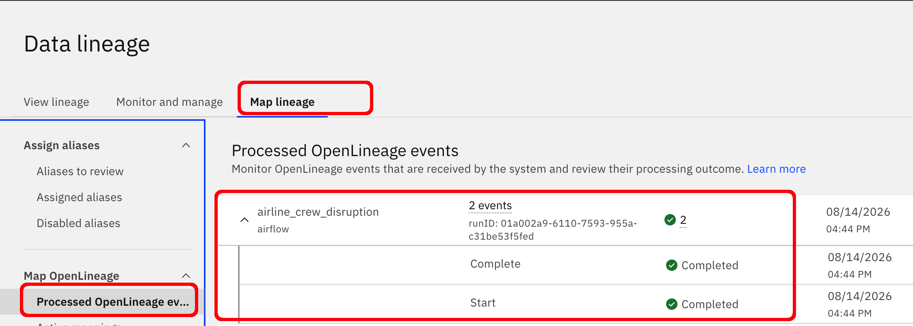


## View the completed lineage

The lineage now shows the path of the data that lands in the <code>disruption_summary</code> table: the data was read from the view <code>vw_crew_disruption_detail</code> by the Airflow Dag <code>airline_crew_disruption</code> which processed the data and then wrote to the <code>disruption_summary</code> table.

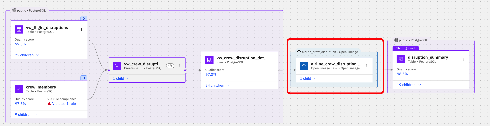

Make sure to also note the data quality scores and Data Quality SLA violation shown on the tables, and to explore the column level lineage!

## Example Airflow OpenLineage Events
There are a couple of example Airflow OpenLineage event payloads in the folder [here](openlineage-events).  

## Final note
Hopefully this example helps describe the setup needed to integrate Airflow with watsonx.data intelligence. Feel free to ping me (mark.brooks@ibm.com) over email or Slack if you have any questions about this project.
